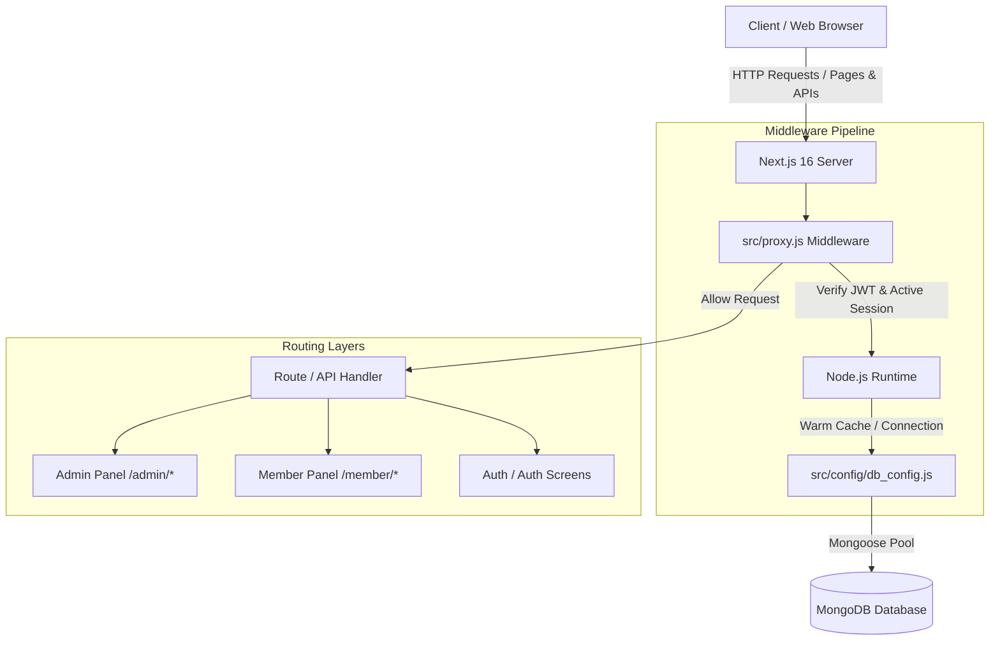
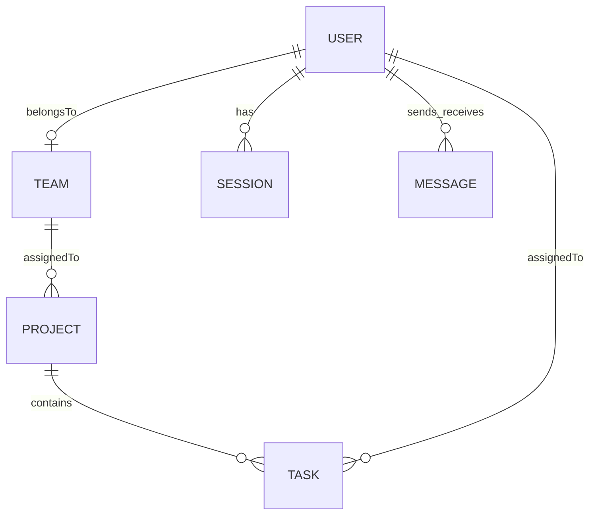

# Ethara AI — Enterprise Project & Task Management System

Ethara AI is a full-stack, enterprise-grade project and task management system built with role-based access control (RBAC). It is designed to coordinate operations between **Administrators** (who manage teams, users, projects, and assignments) and **Team Members** (who track progress, update task statuses, collaborate, and manage their assigned scopes).

The application is built on **Next.js 16 (App Router)**, **React 19**, and **MongoDB (Mongoose)** with a premium glassmorphic UI styled using Tailwind CSS and components from **shadcn/ui**.

---

## 🌟 Key Features & Functional Modules

### 1. 🔑 Security & Authentication System
- **Next.js 16 Proxy Engine**: Utilizes the modern `proxy.js` middleware (replacing the deprecated `middleware.js` convention) running under the **Node.js runtime** to allow direct database queries and JWT verification on routing hooks.
- **JWT-Token Cookie Architecture**: Implements a secure dual-cookie token system with HttpOnly, SameSite=strict cookies (1-day access token, 5-day refresh token).
- **Session Telemetry & Tracking**: Tracks logins in the `Session` model. Captures device type, browser, IP address, and location. Capped at a maximum of 5 concurrent sessions per user (oldest are automatically cleared).
- **Email Verification**: Admin accounts require email verification before their first login. Verification codes are sent using **Nodemailer** with custom **React Email** HTML templates.
- **Password Reset**: Secure token-based password reset via email.

### 2. 👑 Admin Workspace & Management Tools
- **Stats Dashboard**: High-level telemetry displaying active users, projects, task completion rates, a 6-month interactive Area Chart tracking progress, and recent activity logs.
- **User Management**:
  - Direct user registration.
  - **Bulk User Import**: Allows uploading a JSON array of users to register them simultaneously.
  - Paginated user list with full-text search.
  - Password resets and account deletion.
- **Team Management**: Create, edit, and delete teams. Assign members directly to team rosters.
- **Project Management**: Initialize projects and assign them to specific teams.
- **Task Management**:
  - Single task creation with priority, due date, and description.
  - **Bulk Team Assignment**: Admin can assign a single task to an *entire team* simultaneously, automatically creating individual task instances for each team member.
- **Progress Telemetry**: Visual filters to drill down into task completion statuses by project, team, or individual member.

### 3. 👥 Member Workspace & Collaboration Tools
- **Stats Dashboard**: Personal dashboard showing task counts (To Do, In Progress, Done), overdue alerts, upcoming deadlines, productivity completion rings, and recent direct messages.
- **Kanban Board & List Views**: Fully interactive views for managing assigned tasks. Members can drag tasks between columns, click to view details, and post progress notes.
- **Teammate Directory ("My Team")**:
  - Displays the active team details, department, and supervisor details.
  - Generates teammate directories with initial-derived, color-coordinated avatars.
  - Includes a direct **Message** shortcut next to each member to initialize chat rooms.
- **Project Telemetry ("My Projects")**:
  - Live list of projects assigned to the member's team.
  - Shows completion rate progress bars dynamically computed on the backend.
  - Lists status counters (To Do, In Dev, Completed) for each project.
  - Includes a shortcut link to filter the task board for that project.
- **Direct Messaging**: A real-time chat interface to message other members of the workspace.

### 4. 🔍 Global Header Search
- An interactive search bar in the global header with debouncing and animated glassmorphic dropdowns.
- Queries the `/api/search` endpoint. Admins can search across all tasks and projects, while team members can search tasks assigned to them and projects assigned to their team.
- Clicking a search result redirects the user directly to the target item on their task board.

---

## 🏗️ System Architecture & Data Flow

Ethara AI is designed as a secure, role-based, multi-tenant enterprise system. The core architecture uses a Node.js-based middleware proxy for route guarding and session synchronization.



### Next.js 16 Custom Proxy Middleware
A major architectural highlight of Next.js 16 in this project is the deprecation of the older edge-runtime `middleware.js` convention in favor of **`proxy.js`**. 

1. **Node.js Runtime by Default**: Unlike the restricted Edge runtime, `proxy.js` runs in a full Node.js environment. This allows us to perform intensive cryptographic computations (via `jsonwebtoken`) and connect directly to MongoDB (`connectionDb()`) during the routing hook itself.
2. **Session and Auth Verification**: In `src/proxy.js`, on every page transition (excluding public assets and APIs), the server:
   - Verifies the `token` cookie (JWT).
   - Establishes a connection to the MongoDB Atlas cluster.
   - Checks the session registry (`Session` model) by referencing the `sessionId` cookie.
   - Automatically updates the `lastActive` timestamp of the current session (debounced to once every 30 seconds).
   - Validates user role access boundaries (e.g., blocking members from `/admin/*` and admins from `/member/*`).

---

## 🗄️ Database Schemas & Relations

The database layer consists of six core MongoDB schemas, linked via references (`ObjectId`):



### 1. User Schema (`User`)
Represents members and administrators.
- **Access Control**: Users must have `isverified: true` to authenticate. Admins must have both `isAdmin: true` and `role: "admin"`.
- **References**:
  - `teamId`: Points to the user's active `Team` (optional for admins).

### 2. Team Schema (`Team`)
Defines organizational boundaries.
- **Roster**: Contains an array of references to `User` (`members`).
- **Ownership**: Tracks the creator Admin via `createdBy`.

### 3. Project Schema (`Project`)
Scopes and groups specific tasks.
- **Mapping**: Belongs to exactly one `Team` (`teamId`).
- **Ownership**: Tracks the creator Admin via `createdBy`.

### 4. Task Schema (`Task`)
Represents granular units of work.
- **Lifecycle**: Status can transition between `todo`, `in-progress`, and `done`. Priority scales between `Low`, `Medium`, and `High`.
- **References**:
  - `assignedTo`: Reference to the `User` performing the task.
  - `projectId`: Reference to the parent `Project`.
- **Telemetry & Logs**: Contains a subdocument array `updates` logging notes and comments with a timestamp and the user who posted them (`postedBy`).

### 5. Session Schema (`Session`)
Maintains active device logins.
- **Session Limits**: Enforces a strict maximum of **5 concurrent active sessions** per user. If a user logs in on a 6th device, the oldest session is automatically deleted from the database.
- **User Agent Parsing**: Extracts `device` type (Desktop, Mobile, Tablet) and `browser` engine from client request headers on login.

### 6. Message Schema (`Message`)
Enables direct peer-to-peer collaboration.
- **Tracking**: Logs `sender` and `receiver` `ObjectId`s, message `content`, and read receipt (`isRead`).

---

## 🔄 Core Workflow Operations

### 🔑 The Dual-Cookie Authentication Flow
Ethara AI uses a secure token rotation mechanism based on HttpOnly, SameSite=strict cookies to prevent CSRF and XSS attacks:
1. **Credentials verification**: Authenticates username/email and hashes password checks via `bcryptjs`.
2. **Token generation**: Creates a 1-day JWT access token (`token`) and a 5-day JWT refresh token (`refreshToken`).
3. **Session registration**: Inserts a new document in the `Session` model.
4. **Cookie Dispatch**: Transmits tokens and session identifier as encrypted cookies to the client.

### 👥 Bulk Team Task Assignment Workflow
To simplify management, administrators can assign a single task to an *entire team* in one action.
1. The admin fills out the task form, selects a Project, ticks "Assign to Team", and submits.
2. The payload sends the task information along with an array of member IDs.
3. The backend API (`POST /api/tasks`) loops through the member IDs and generates a distinct, individual `Task` document for each member in a parallel batch (`Promise.all`).
4. Each member receives their own independent copy of the task on their Kanban board, allowing individual progress tracking while remaining linked to the same Project.

### 💬 Live Messaging Flow
Team collaboration is powered by a poll-based/direct routing setup:
1. Team members click **Message** on a teammate's profile inside the "My Team" directory.
2. The user is redirected to the `/member/messages` panel, automatically selecting the recipient.
3. The messaging UI initializes a history pull from `GET /api/messages?receiverId=<recipient_id>`.
4. Messages posted are dispatched to `POST /api/messages` and immediately saved to MongoDB, keeping discussions persistent and audit-compliant.

---

## 📡 API Endpoint Catalog & Reference

All endpoints enforce session authentication. Role classifications are verified via the JWT access token.

### 1. 🗝️ Authentication & Session APIs (`/api/auth/*`)

#### User Login (`POST /api/auth/login`)
- **Access**: Public
- **Request Payload**:
  ```json
  {
    "email": "user@company.com", // Or "username": "user_dev"
    "password": "Password@123",
    "role": "admin" // Optional: "admin" | "member"
  }
  ```
- **Response**:
  ```json
  {
    "message": "Logged In Successfully",
    "success": true,
    "user": {
      "id": "603d2b...",
      "username": "saurabh_dev",
      "full_name": "Saurabh Kumar",
      "email": "user@company.com",
      "role": "admin",
      "isAdmin": true,
      "company": "Ethara",
      "joined": "2026-05-22T12:00:00.000Z"
    },
    "sessionId": "603d2c..."
  }
  ```

#### Admin Registration (`POST /api/auth/register`)
- **Access**: Public
- **Request Payload**:
  ```json
  {
    "username": "admin_user",
    "email": "admin@company.com",
    "full_name": "Admin Name",
    "password": "StrongPassword@123",
    "job_title": "Project Director",
    "department": "Engineering",
    "company": "Ethara Corp"
  }
  ```
- **Response**:
  ```json
  {
    "message": "User Registered successfully. Verification email sent.",
    "success": true
  }
  ```

#### Verify Admin Code (`POST /api/auth/verify_admin`)
- **Access**: Public
- **Request Payload**: `{"token": "123456"}`

#### Fetch User Profile (`GET /api/auth/user_profile`)
- **Access**: Authenticated

#### Update Profile (`PATCH /api/auth/update_profile`)
- **Access**: Authenticated
- **Request Payload**: `{"full_name": "New Name", "job_title": "Lead Dev"}`

#### Active Session Registry (`GET /api/auth/session`)
- **Access**: Authenticated

#### Terminate Session (`DELETE /api/auth/session`)
- **Access**: Authenticated
- **Query Parameters**: `?id=<sessionId>` (to terminate a specific device) or `?all=true` (to logout all other devices).

---

### 2. 👑 Admin-Only APIs (`/api/*`)

#### Teams Management (`/api/teams`)
- **GET /api/teams**: Lists all teams with members populated.
- **POST /api/teams**: Creates a team.
  - *Payload*: `{"name": "Alpha-Ops", "members": ["userId1", "userId2"]}`
- **PATCH/DELETE /api/teams/[id]**: Update or delete team rosters.

#### Projects Management (`/api/projects`)
- **GET /api/projects**: Lists all projects.
- **POST /api/projects**: Creates project under a team.
  - *Payload*: `{"name": "Revamp API", "description": "Backend upgrade", "teamId": "teamId"}`
- **PATCH/DELETE /api/projects/[id]**: Update or delete projects.

#### Tasks Management (`/api/tasks`)
- **GET /api/tasks**: Lists all tasks. Supports filtering via `?projectId=...`.
- **POST /api/tasks**: Single or Bulk task creation:
  - *Bulk Team Assignment Payload*:
    ```json
    {
      "title": "Complete Training",
      "description": "Read docs",
      "projectId": "projectId",
      "assignToTeam": true,
      "memberIds": ["memberId1", "memberId2"],
      "dueDate": "2026-06-01",
      "priority": "Medium"
    }
    ```
- **PATCH/DELETE /api/tasks/[id]**: Edit task variables or delete tasks.

#### User Accounts Management (`/api/users`)
- **GET /api/users**: Returns a paginated list of team members with search capability.
  - *Query Params*: `?page=1&limit=10&search=Saurabh`
- **POST /api/users**: Registers members. Accepts a single user object or a bulk upload JSON array.
- **PATCH/DELETE /api/users/[id]**: Overwrites passwords, updates metadata, or deletes accounts.

#### Progress Telemetry (`/api/admin/progress`)
- **GET /api/admin/progress**: Computes statistics for dashboard rendering.
  - *Query Params*: `?projectId=...` or `?memberId=...`.

---

### 3. 💻 Member Workspace APIs (`/api/member/*`)

#### Member Dashboard Analytics (`GET /api/member/dashboard`)
- **Access**: Authenticated (Member / Admin)

#### My Team Directory (`GET /api/member/team`)
- **Access**: Authenticated (Member / Admin)
- **Description**: Identifies the team the logged-in user belongs to, fetches the Team details, lists the Manager/Supervisor (the Admin who created the team), and populates all active teammates.

#### My Projects Telemetry (`GET /api/member/projects`)
- **Access**: Authenticated (Member / Admin)
- **Description**: Returns all projects assigned to the member's team with dynamically aggregated task progress percentages and status counts.

---

### 4. 💬 Messaging & Search APIs

#### Direct Messages (`/api/messages`)
- **GET /api/messages?receiverId=...**: Pulls chat history between the logged-in user and the recipient.
- **POST /api/messages**: Sends a message.
  - *Payload*: `{"receiver": "receiverUserId", "content": "Hello!"}`

#### Role-Restricted Search (`GET /api/search?q=...`)
- **Description**: Queries tasks/projects. Admins search globally; members are locked to their own assigned tasks and team projects.

---

## 🛠️ Administrator & Developer Utility Scripts

The project contains several standalone Node.js utility scripts located in the root directory. These scripts bypass the Next.js routing stack to interact directly with the MongoDB database using mongoose. They are designed for database diagnostics, quick fixes, and seeding initial administrative access.

### Prerequisites for Running Scripts
1. **Environment Variables**: Make sure the `.env` file contains your database connection string under `PROD_DATABASE_URL` (or `MONGODB_URI` depending on the script).
2. **Execution Command**: Run using `node <script_name>.js` (ES Modules are supported via `"type": "module"` in `package.json`).

### Script Catalog

#### 1. `force_admin.js`
- **Purpose**: Instantly creates or upgrades an account to a verified administrator.
- **Action**: Connects to the database and runs `findOneAndUpdate` for the email specified in the script (`saurabhkumar.dpg@gmail.com` by default), sets `isAdmin: true`, `role: "admin"`, and `isverified: true`.
- **Command**: `node force_admin.js`

#### 2. `fix_admins.js`
- **Purpose**: Resolves role conflicts in the user registry.
- **Action**: Finds all users in the database where `role` is `"admin"` but `isAdmin` is not yet set to `true`, and updates them to `isAdmin: true` in bulk.
- **Command**: `node fix_admins.js`

#### 3. `verify_users.js`
- **Purpose**: Marks all registered users as email-verified.
- **Action**: Updates all users where `isverified` is not equal to `true`, setting it to `true`.
- **Command**: `node verify_users.js`

#### 4. `reset_pass.js`
- **Purpose**: Resets a user's password to a secure value.
- **Action**: Hashes the new password (e.g., `Password@123` by default) using `bcryptjs` with 10 salt rounds and updates the document for the specified username (`Aadi_ai` by default). It also ensures the account is marked verified.
- **Command**: `node reset_pass.js`

#### 5. `check_admin.js`
- **Purpose**: Database diagnostics and indexing checks.
- **Action**: Prints the profile details of `saurabhkumar.poly123@gmail.com`, counts the total number of users matching query filters, and verifies if target email `2301731114@krmu.edu.in` exists in the indexing list.
- **Command**: `node check_admin.js`

---

## 📂 Directory Layout

```
src/
├── app/
│   ├── (admin)/admin/          # Admin pages (dashboard, teams, projects, tasks, users, progress)
│   ├── (auth)/auth/            # Authentication screens (login, signup, password-reset, email-verify)
│   ├── (member)/member/        # Member pages (dashboard, tasks, team, projects, messages)
│   └── api/                    # Backend API endpoints
│       ├── admin/              # Admin analytics & progress reports
│       ├── auth/               # Session, token refresh, registration, login, and verification APIs
│       ├── member/             # Member data sources (dashboard stats, tasks, team directory, projects)
│       ├── messages/           # Direct messaging backend
│       ├── projects/           # Projects CRUD operations
│       ├── search/             # Role-based search endpoint
│       ├── tasks/              # Tasks CRUD & bulk assignment logic
│       └── teams/              # Teams management endpoints
├── components/
│   ├── ui/                     # shadcn/ui components (card, dialog, table, badge, select, etc.)
│   └── app_component/          # Feature-specific widgets (welcome banners, charts, message boxes)
├── models/                     # Mongoose schemas (User, Team, Project, Task, Session, Message)
├── api/api.js                  # Axios client services
├── config/db_config.js         # Mongoose connection layer with active connection caching
├── schema/                     # Zod payload validation schemas
├── utils/                      # Auth helpers, Nodemailer, and Axios interceptor setups
├── hooks/                      # Custom React hooks (e.g. useDebounce)
├── logger/                     # Winston logging configuration
└── template/                   # Email templates
```

---

## 🚀 Installation & Local Development

### 1. Setup Environment Configuration
Create a `.env` file in the root directory:
```env
# Database Configuration
PROD_DATABASE_URL=mongodb+srv://<username>:<password>@cluster.mongodb.net/ethara
MONGODB_URI=mongodb+srv://<username>:<password>@cluster.mongodb.net/ethara

# JWT & Session Secrets
TOKEN_SECRET=your_jwt_access_secret_key
SESSION_SECRET=your_session_secret_key

# SMTP Configuration (Gmail)
SMTP_HOST=smtp.gmail.com
SMTP_PORT=587
SMTP_USER=your_email@gmail.com
SMTP_PASS=your_gmail_app_password
SENDER_EMAIL=your_email@gmail.com

# Core URLs
DOMAIN_URL=http://localhost:3000
NEXT_PUBLIC_API_URL=http://localhost:3000/api

# Environment Mode
NODE_ENV=development
```

### 2. Install Dependencies
```bash
pnpm install
```

### 3. Start Development Server
```bash
pnpm dev
```
Open [http://localhost:3000](http://localhost:3000) to view the application.

### 4. Build for Production
```bash
pnpm build
pnpm start
```
